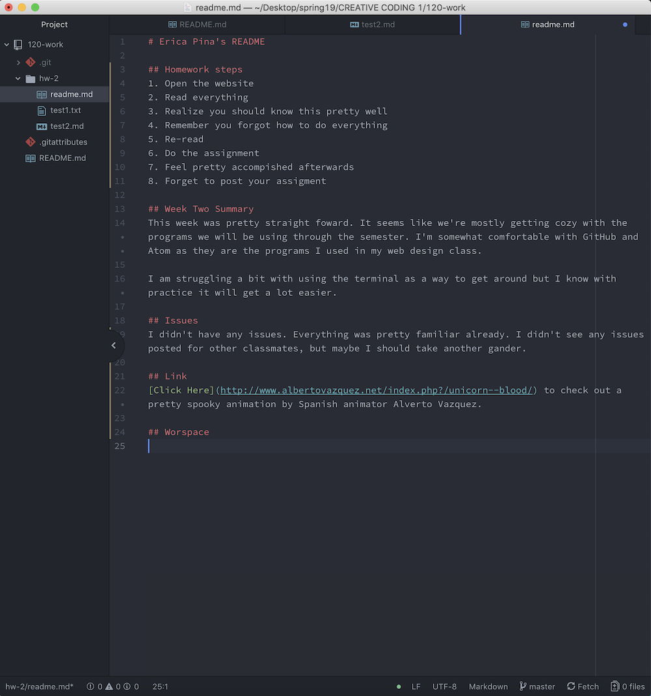

# Erica Pina's README

## Homework steps
1. Open the website
2. Read everything
3. Realize you should know this pretty well
4. Remember you forgot how to do everything
5. Re-read
6. Do the assignment
7. Feel pretty accomplished afterwards
8. Forget to post your assignment

## Week Two Summary
This week was pretty straightforward. It seems like we're mostly getting cozy with the programs we will be using through the semester. I'm somewhat comfortable with GitHub and Atom as they are the programs I used in my web design class.

I am struggling a bit with using the terminal as a way to get around but I know with practice it will get a lot easier.

## Issues
I didn't have any issues. Everything was pretty familiar already. I didn't see any issues posted for other classmates, but maybe I should take another gander.

## Todo List
- Finish flipbook
- Read assigned reading
- Take a nap
- Work on Homework
  - Forget homework and play video games instead

## Link
[Click Here](http://www.albertovazquez.net/index.php?/unicorn--blood/) to check out a pretty spooky animation by Spanish animator Alverto Vazquez.

## Workspace

