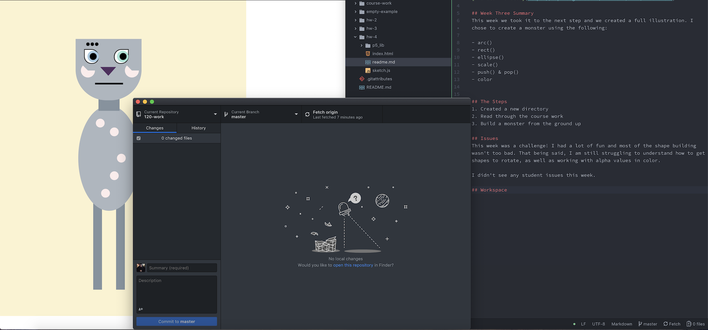

# Erica Charmaine Pina

["Monster" Sketch](https://ecpina.github.io/120-work/hw-4/index.html)

## Week Three Summary
This week we took it to the next step and we created a full illustration. I chose to create a monster using the following:

- arc()
- rect()
- ellipse()
- scale()
- push() & pop()
- color

## The Steps
1. Created a new directory
2. Read through the course work
3. Build a monster from the ground up

## Issues
This week was a challenge! I had a lot of fun and most of the shape building wasn't too bad. That being said, I am still struggling to understand how to get shapes to rotate, as well as working with alpha values in color.

I didn't see any student issues this week.

## Workspace

