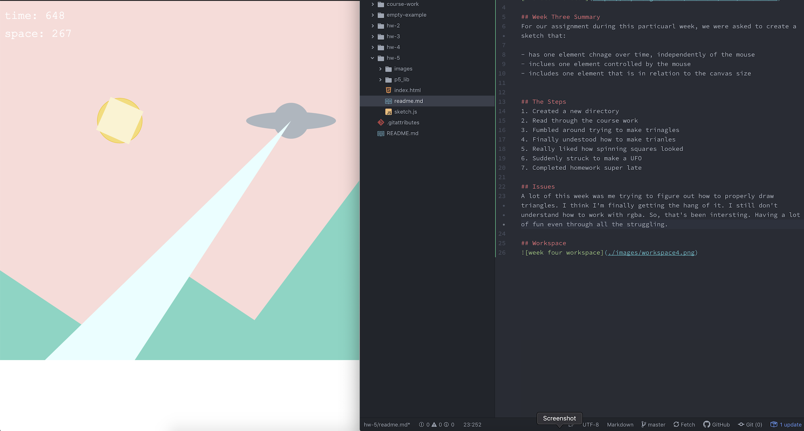

# Erica Charmaine Pina

["Monster" Sketch](https://ecpina.github.io/120-work/hw-4/index.html)

## Week Three Summary
For our assignment during this particuarl week, we were asked to create a sketch that:

- has one element chnage over time, independently of the mouse
- inclues one element controlled by the mouse
- includes one element that is in relation to the canvas size

## The Steps
1. Created a new directory
2. Read through the course work
3. Fumbled around trying to make trinagles
4. Finally undestood how to make trianles
5. Really liked how spinning squares looked
6. Suddenly struck to make a UFO
7. Completed homework super late

## Issues
A lot of this week was me trying to figure out how to properly draw triangles. I think I'm finally getting the hang of it. I still don't understand how to work with rgba. So, that's been intersting. Having a lot of fun even through all the struggling.

## Workspace

