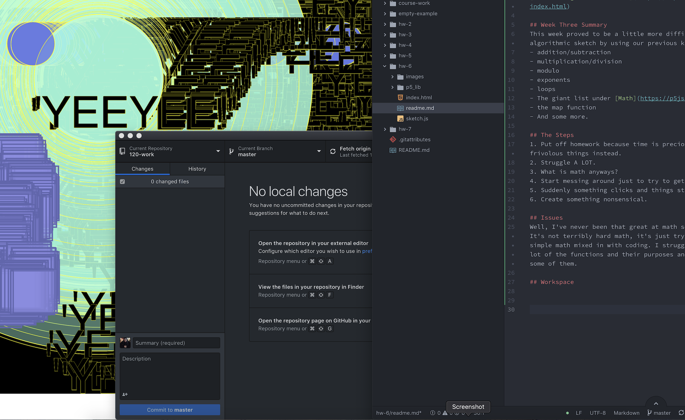

# Erica Charmaine Pina

[Loop Sketch](https://ecpina.github.io/120-work/hw-8/index.html)

## Week Three Summary
This week was a little more relaxed and we learned to work with loops. Since I had fallen behind, it was a good time to try to get things finished and turned in. This week we went into depth about:
- number variable (i)
- more math
- let vs var
- nested loops
- while Loops

## My Design
I spend most of my time just expirementing. I wanted to do something more complex but I found that my code kept breaking. So I shuffled stuff around and added and removed and spent a lot of time pulling my hair trying before remember that things have to go in a certain order. My green ellipses were actually a mistake but I really liked how they looked and so then I was trying to figure out a way to compliment them. There was some more hair pulling before I decided to go with something a little more simple. I'm actually pretty happy about the turn out, even in it's simplicity.

## Issues
I fell behind with the homework. I found myself struggling a lot with the math and getting things to look how I want them to look and my code breaking. I spent most of this week finishing old assignemnts as well as just playing around, trying to get things to happen. I've alwasy been a very visual person so a lot of the times I'm just tinkering with the code until things either do what I want or something unexpectly interesting happens.

This next week, I really want to focus on understanding what I'm writing. I feel like some things make sense the more I fiddle around, but I'm not working at the pace I'd like to.

## Workspace

